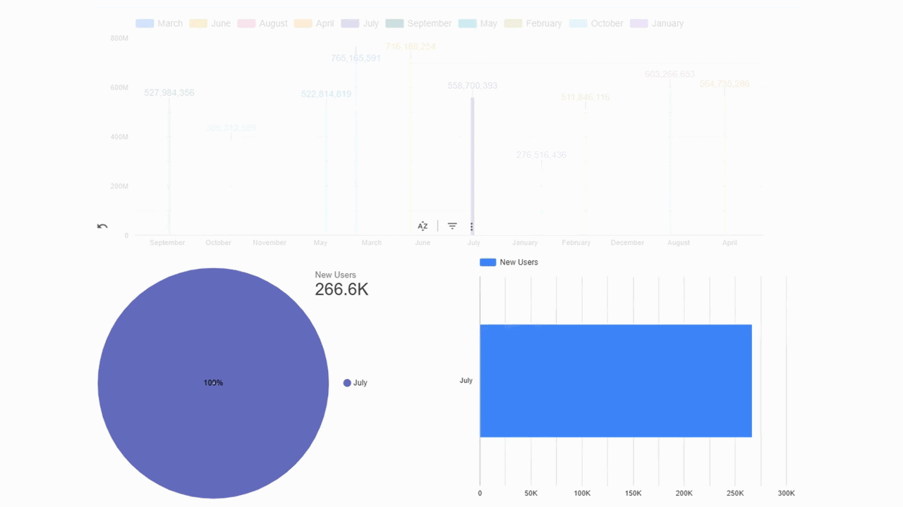

# Tawakkalna User Analytics Dashboard (2023)

Course: Data Analysis and Design  
Tool Used: Google Looker Studio

## Project Overview:
The goal of this project is to use what I learned in the course to work with real data. I focused on analyzing the number of new users for the Tawakkalna platform in 2023. I cleaned the data, explored it, and then created a simple dashboard using Google Data Studio. This helped me understand the trends better and show the results in a clear and organized way.

## Description of data set
Dataset Name: New Users for Tawakkalna Platform (Monthly)

Description: This dataset shows the number of new users who registered on the Tawakkalna platform each month during the year 2023, It also includes the number of operations done on the platform monthly.

Number of Instances (Rows): 13

Number of Attributes (Columns): 4

## Description of methodology

In this project, I started by collecting the data about new users of the Tawakkalna platform for the year 2023. Then, I cleaned the data to make sure everything was correct and well-organized. After that, I used Google Data Studio to perform Exploratory Data Analysis (EDA). I created simple charts to show the number of users each month. I also designed the dashboard in a clear and organized way to make it easy to understand. Each step was documented with screenshots.

## Objectives
- Identify peak and low activity periods
- Analyze monthly user registration trends
- Visualize insights through interactive dashboards
- Apply real-world data cleaning and visualization techniques

## Tools & Technologies
- Saudi Open Data (SDAIA)
- Microsoft Excel (Data Cleaning)
- Google Looker Studio (Data Visualization)

## Key Insights
- Summer months showed lower registration rates
- March recorded the highest number of new users
- User activity was strongest in the first half of the year

## What I Learned
- Trend analysis
- Data cleaning and preparation
- Dashboard design and visualization

## Conclusion

In this project, I analyzed real data from the Tawakkalna platform for the year 2023. I went through the steps of cleaning, exploring, and visualizing the data using Google Data Studio. By doing this, I was able to understand how the number of new users changed each month and identify useful trends. This project helped me apply what I learned in class to a real-world example and improve my skills in data analysis and dashboard design.

## Dashboard Demo

